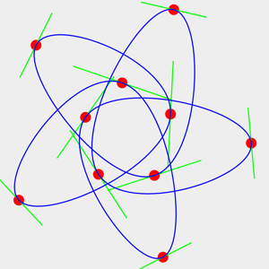
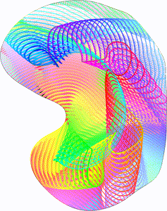
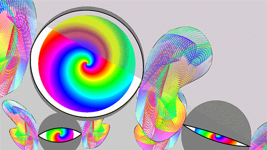
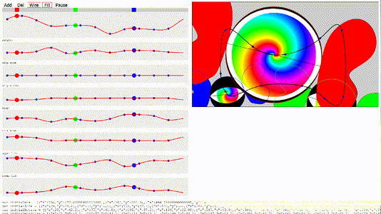
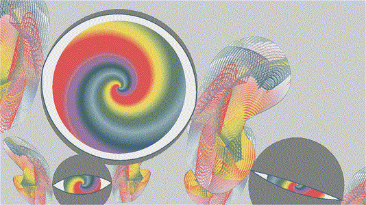

# Welcome to the Wonderful World of Bezeye

Bezeye is an animated GIF showcasing Bézier Curve Texture+Movement and Spatial Color Quantization.  
It is also a contribution entry for the Evoke 2014 demoscene party [https://www.evoke.eu/2014](https://www.evoke.eu/2014).  
With size limitations, Bezeye tries to find the optimum between maximizing the number of frames and reducing the number of colours in a frame.  
End result are 60 frames at 20fps resulting in a 20M animated GIF.  
This project contains the modernised snapshot of the source for the code+tools, artwork and settings to create the GIF.

##  Showcasing

The animation shows three floating eyes, each checking you out, dragging and confusing your attention with wide-spectrum colours.  
Movement is cyclic to make the replay a seamless continuation.  
The initial size of 1920x1080 was too demanding for the compo machine and was reduced to 1280x720.  
Using a tiny colour palette containing 7 colours that captures the perception of the variety of colours used.  
Outline and texture of the wings are Bézier curve based.  
Choreography is storyboard driven and stored as Bézier curves.

## Bézier curves

Natural movement is always in motions, direction changes gradually and never abrupt.  
Bézier curves are cubic polynomials that create patterns found in nature.  
The curve algorithms are from the Closed Continuous Bézier Curve project `ccbc` that re-masters the maths.  
Major enhancements are on-curve control points and ultra high-speed control point encoding.  
The `ccbc` project can be found here: [https://github.com/RockingShip/ccbc](https://github.com/RockingShip/ccbc)

Below is a small interactive demonstration of a 10-point re-mastered curve:  
Click on the image to jump to the containing page.  
The red pads can be dragged to change the curve.  
The green lines illustrate where the traditional off-curve control points are located.

## Wings

Wing texture is created by rendering a Bézier curve and moving its on-curve control points.  
The control points move in a cyclic fashion allowing a seamless loop.  
Each rendering of the curve is done with a rainbow colouring that cycles.  
Frames are transparent, the animation needs to run an extra cycle before they become seamless.  
The animation is 60 frames long and 120 frames are created.

Below is an image of the base curve, click on the image to jump to the animation.

## Colour reduction

Colour reduction improves the compression used in `GIF` images.  
Spatial Color Quantization (`scq`) is used to reduce the palette to 7 colours.  
`scq` dithers an image using a smaller replacement palette.  
The colour average of the dithered image matches the average of the original.  
A `3x3` or `5x5` grid is used t calculate the average of the center pixel.       

Below is link to a comparison page displaying different palette sizes ranging from 4 to 16 colours.  
The animations are split-screen, the lower left being the original true-colour and upper right being the colour reduced.

## Storyboard

The storyboard describes the eyes' choreography.  
It displays movement and 8 attributes as a seamless loop.  
Choreography tracks are closed continuous Bézier curves.  
Attention has been put into not making the wings collide when they pass each other.

Below is a link to the storyboard.  
At the bottom of the page are the Bézier control points that are manually cut/pasted into the rendering code. 

# Original entry

The original entry was a collaboration with Hopscotch who supplied the Bézier outlines and storyboard settings.  
It differs with this project in that it uses a different 7-colour palette.  
Sadly I cannot reconstruct its creation.

Click on the image below to open the animation:

# Requirements

* `gcc` or compatible
* `libgd` for 2d graphics support [https://libgd.github.io](https://libgd.github.io)
* `mootools` for the scoreboard GUI [https://mootools.net](https://mootools.net)
* `php` for scripts
* `ffmpeg` (optional) for comparison

# Building

- Create makefiles  
./autogen.sh  
./configure  
make

- Load the storyboard into a browser and tweak accordingly.  
Copy the `JSON` data to `render.php`.

- Create wing texture  
`mkdir wingdata`  
`php wing.php wingdata/%02d.png`  
This will generate 3 cycles of 60 frames that should animate as seamless.

- Create truecolour frames for animation (hardcoded 1280x720)  
`mkdir frames-1280x720`  
`php render.php wingdata/%02d.png frames-1280x720/%03d.png`  
This will create 120 frames.

- Extract 7 colour palette from first frame (NOTE: file has been bundled)  
`make palette-7.pal`  
You need to manually copy the last lines, strip the first column and paste result in `palette-7.pal`.

- Colour compress frames  
./gen-bezeye.sh

- collect parts for animated gifs  
./mergeraw bezeye-1280x720-7.gif bezeye-1280x720-7/img-000.gif bezeye-1280x720-7/diff-???.gif --delay=5 -f

# Files

- `anim/`

    [anim/evoke2014-1280x720-7.gif](anim/evoke2014-1280x720-7.gif)  
    Contribution entry

    [anim/evoke2014-1280x720-7-colors.gif](anim/evoke2014-1280x720-7-colors.gif)  
    Palette containing the 7 colours

    [anim/tookbox-gui.png](assets/tookbox-gui.png)  
    Screenshot of GUI

    [anim/wing-400x505-180.gif](anim/wing-400x505-180.gif)  
    Wing colour texture, three 60 frame cycles starting with black background

    [anim/wing-400x505-60.gif](anim/wing-400x505-60.gif)  
    Wing colour texture, last 60 frame cycle with seamless loop

- `tools/`

    [tools/gen-bezeye.sh](tools/gen-bezeye.sh)  
    Script for colour compressing frames

    [tools/Build.txt](Build.txt)  
    Manual build instructions

    [tools/diffgif.cc](diffgif.cc)  
    GIF transparency encoder for frames

    [tools/evoke7.pal](tools/evoke7.pal)  
    Fixed 7-colour palette. Created by catching debug output fro `scq`

    [tools/mergeraw.cc](mergeraw.cc)  
    Create animated GIF from individual frames

    [tools/mootools-*.js](mootools-core-1.4.5.js)  
    Mootools framework for [tools/storyboard.html](storyboard.html)

    [tools/render.php](tools/render.php)  
    Render true-colour frames

    [tools/scq6.cc](scq6.cc)  
    Spatial Color Quantization, convert true-colour to palette

    [tools/storyboard.html](storyboard.html)  
    Storyboard GUI. Paste the settings in `render.php`

    [tools/vleugel1.php](tools/vleugel1.php)  
    Render true-colour bézier based texture for wings

# Installation

The file [tools/Build.txt](Build.txt) contains manual instructions to re-create the competition entry.

This project focuses on a single use-case with no consideration towards portability.

# Versioning

Using [SemVer](http://semver.org/) for versioning. For the versions available, see the [tags on this repository](https://github.com/xyzzy/bezeye/tags).

# License

This project is licensed under the GNU General Public License v3 - see the [LICENSE.txt](LICENSE.txt) file for details

## Acknowledgments

* Hopscotch for the amazing analog input and storyboard settings
* Derrick Coetzee and his amazing work on Spatial Color Quantization.
* [https://github.com/RockingShip/ccbc](https://github.com/RockingShip/ccbc) project for the amazing work on Closed Continuous Bézier Curves
* [https://github.com/xyzzy/jsGifEncoder](https://github.com/xyzzy/jsGifEncoder) project for the high-speed inline GIF encoding
* [https://github.com/xyzzy/scq](https://github.com/xyzzy/scq) project for the enhanced Spatial Color Quantization implementation
